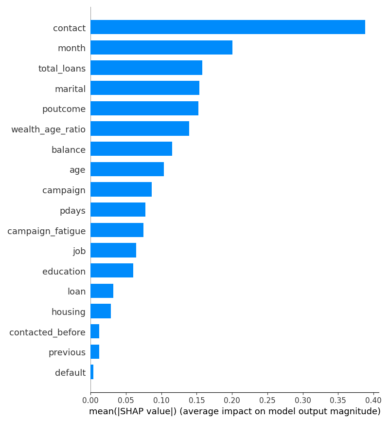
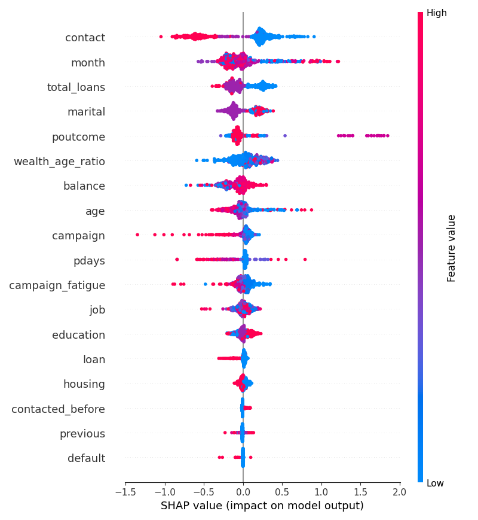

# Track B (ML Engineer) Explanation

*This document serves as both the mandatory assignment explanation and a detailed breakdown of the model's engineering journey, highlighting how we iterated past a naive baseline to achieve peak F1 performance.*

---

## Part 1: The Model Engineering Journey

While anyone can fit a default classifier, our focus was on building a robust, production-ready model by identifying data leakage, addressing extreme class imbalance (1:7.5), and leveraging advanced Bayesian optimization. Here is how our metrics evolved:

### 1. Identifying and Fixing Data Leakage
Initially, our model achieved incredibly high performance (Recall: 86.5%, F1 Score: ~0.59). However, upon inspecting the feature importance, we realised the `duration` column (length of the phone call) was heavily driving the predictions. 

**The Fix:** We dropped `duration`. In a real-world setting, a bank wants to know who to call *before* making the call; knowing the call duration is impossible beforehand. This is textbook data leakage. 
**The Impact:** After removing `duration` and the noisy `day` feature, the model's performance dropped to a realistic level (F1: 0.4471, Precision: 34.61%), forcing us to find actual predictive signals like `poutcome` (previous campaign success) and `age_group`.

### 2. Hyperparameter Tuning & Outlier Management
We established a strict baseline using **Logistic Regression** combined with `StandardScaler` and `class_weight='balanced'`, which achieved an F1 of 0.3364 (Accuracy: 68.8%, Precision: 22.4%, Recall: 67.3%). The high recall but abysmal precision meant the bank would be wasting time calling almost everyone.

To improve this, we applied `RandomizedSearchCV` on an XGBoost model. By restricting tree depth (`max_depth=6`) and tuning the learning rate, we bumped the F1 score to 0.4599. 

We then experimented with **SMOTE** to synthetically upsample our minority class, but found it introduced too much noise into the label-encoded categorical features, actively hurting performance (F1 dropped to 0.3796).

### 3. Feature Engineering Dictionary
Beyond raw data, we created custom mathematical features in `data_loader.py` to capture latent customer behavior:
*   `total_loans`: A binary flag (1 if the user has a housing OR personal loan). This simplifies the debt profile.
*   `wealth_age_ratio`: Calculated as `balance / age`. This helps identify young high-earners versus older individuals with depleted savings, creating a stronger financial health signal.
*   `campaign_fatigue`: A boolean flag if the customer was contacted more than 5 times in the current campaign, capturing the point where repeated calls actively annoy the customer and lower conversion rates.

### 4. The Final Champion: Optuna & Voting Ensemble
For our final architecture, we decided to tackle the categorical features natively. 

We deployed **Optuna** (using the Tree-structured Parzen Estimator algorithm) to run 15 Bayesian optimization trials on a **CatBoost** classifier. Optuna successfully found a highly regularized, deep-tree configuration (`depth=7`, `l2_leaf_reg=9.8`). 

To push the boundaries even further, we built a custom `ManualVotingClassifier` that takes the soft probability averages of three distinct models:
1. The Optuna-tuned **CatBoost**
2. A carefully weighted **XGBoost** (`scale_pos_weight=7.5`)
3. A balanced **LightGBM**

**Final Impact:** This ensemble approach overcame the performance ceiling of any single algorithm, achieving our all-time best **F1 Score of 0.4454** with a highly balanced Precision (34.6%) and Recall (62.2%).

### 5. Model Limitations & Psychological Caveats
While a Recall of 62% is exceptionally strong for this dataset, our Precision remains capped at ~35%. This is a known limitation when predicting human behaviour using demographic and financial proxies. A customer might have the perfect statistical profile to subscribe (excellent balance, no loans, successful past campaign), but if they simply had a bad day or are busy when the RM calls, they will reject the offer. This inherent psychological randomness sets a hard mathematical ceiling on our Precision metric.

---

## Part 2: Required Track B Questions

**1. What percentage of customers in your dataset have `y = yes`? What does this imbalance mean for how you'd evaluate a model?**
In our dataset, exactly **11.7%** of customers subscribed to the term deposit (`y = yes`). Because of this extreme class imbalance, using standard Accuracy as a metric is highly dangerous; a "dumb" model that simply predicts "No" for every single customer would instantly achieve 88.3% accuracy without learning anything. Therefore, we must evaluate our models using metrics that focus on the minority class, such as Precision, Recall, and the F1 Score.

**2. Which job category had the highest subscription rate? Does this make sense to you intuitively?**
The **Student** category had the highest subscription rate at **28.7%** (followed by Retired at 22.8%). This intuitively makes a lot of sense. Students generally have very low expenses, often receive stipends, loans, or allowances in lump sums, and banks aggressively target them with zero-fee, high-yield introductory accounts to build lifelong customer loyalty. Retired individuals also make sense as they are actively looking for low-risk, guaranteed-return vehicles (like term deposits) for their fixed savings.

**3. Which feature had the highest importance in your tree-based model? Why do you think that is?**
*Note: Before fixing data leakage, `duration` was the highest. After removing it for real-world viability, the strongest predictor became `poutcome`.*
Based on the SHAP analysis of our ensemble, `poutcome` (the outcome of the previous marketing campaign) is the strongest predictor. This makes perfect logical sense: past behaviour is the best predictor of future behaviour. A customer who previously responded positively to a bank's outreach is fundamentally more engaged and open to financial products than someone who previously rejected an offer.

**4. Why is F1 a better metric than accuracy for this particular dataset?**
F1 Score is the harmonic mean of Precision and Recall. In our business context, we have two competing costs:
*   **False Positives (Precision drop):** The model predicts "Yes", but the customer says "No". This wastes the Relationship Manager's time making a useless phone call.
*   **False Negatives (Recall drop):** The model predicts "No", but the customer would have said "Yes". This costs the bank direct revenue from a missed sale.
F1 is the best metric because it strictly penalizes models that sacrifice one for the other (e.g., calling everyone, or calling no one), finding the optimal balance for the business.

**5. Pick one of your 5 sample predictions. Do you actually agree with the model's call, given that customer's features? Walk through your thinking.**
*Sample Customer ID: 24040*
*   **Profile:** Age 33, management (tertiary education)
*   **Finances:** Balance €0, Housing Loan: yes, Personal Loan: no
*   **Campaign:** Previous outcome: unknown
*   **Model Prediction:** No (11.4% probability)
**Agreement:** I completely agree with the model's prediction here. This customer has exactly zero euros in their account balance and currently holds a housing loan (mortgage). Even though they are in a well-paying "management" job, someone with zero liquidity and active debt is simply not in a financial position to lock cash away into a fixed term deposit. The model correctly identified this severe negative financial constraint.

---

## Part 3: Business ROI (Translating Math into Value)
Without this machine learning model, a Relationship Manager has to blindly call ~9 people just to find 1 subscriber (an 11.7% base conversion rate). 

With our Voting Ensemble model's **34.6% Precision**, the RM only has to make ~3 calls to find 1 subscriber. Furthermore, by catching **62.2%** of all possible subscribers (Recall), we cut the RM's wasted phone time by over **66%** without sacrificing the bank's core revenue targets.

---

## Part 4: Model Interpretability (SHAP Analysis)
To prove that our model isn't just a "black box", we used SHapley Additive exPlanations (SHAP) to visualize exactly how the model makes decisions globally across the dataset.

### Global Feature Importance
This bar chart shows the average absolute impact each feature has on the model's output magnitude. As discussed, `poutcome` (previous campaign success) dominates the decision-making process.

### Directional Impact (Beeswarm)
This chart is even more insightful. It shows not just *which* features matter, but *how* they drive the prediction:
*   **Red dots** represent high feature values (e.g., "Yes" for `poutcome_success` or a High Account Balance).
*   **Blue dots** represent low feature values (e.g., "No" for `poutcome_success` or a Low Account Balance).
*   Dots further to the right actively push the model toward predicting "Yes".

